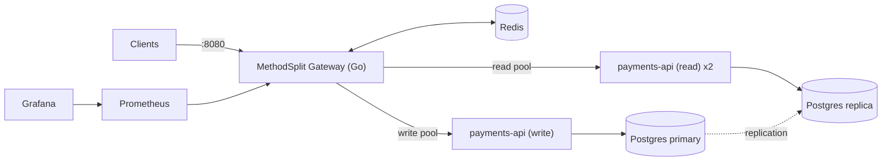

# MethodSplit

**A method-aware Layer 7 API gateway in Go for payment-style APIs.** It separates read traffic from write traffic, prevents duplicate payments with idempotency keys, rate-limits per merchant, and flags abusive clients with a small ML anomaly detector that runs inside the gateway.

<!-- TODO after Phase 9/13: one-line headline result, e.g. "Under a GET flood, write p95 stayed at X ms with the split vs Y ms without it." -->

> **Status:** 🚧 in progress. Built phase by phase; see [docs/BUILD_PLAN.md](docs/BUILD_PLAN.md).

---

## Why

Mobile financial service (MFS) platforms receive far more **reads** (merchants polling payment status, balance checks) than **writes** (create, execute, refund). If both go to the same servers and database, a burst of status polling can slow down real payments. Network retries can also **charge a customer twice**.

MethodSplit handles these problems at the gateway, before requests reach the backend.

## Features

- **Read/write split:** routes are classified by method + path and sent to separate backend pools (read replica vs primary).
- **Idempotency:** `Idempotency-Key` handling in Redis (fast path) plus a database unique key (guarantee). Duplicates are replayed, never re-executed.
- **Read-your-writes:** right after a write, that merchant's reads go to the primary, so they never see stale data.
- **Safe caching:** merchant-scoped, version-invalidated cache for history reads only.
- **Rate limiting:** Redis sliding window (Lua) per IP, per merchant for reads, and per merchant for writes.
- **HMAC request signing** with replay protection.
- **Health checks + failover:** round-robin over healthy instances; reads fall back to the primary.
- **ML anomaly guard:** Isolation Forest trained in Python, scored in **pure Go**, deployed in shadow mode first, then enforce mode.
- **Observability:** Prometheus metrics and a Grafana dashboard.

## Architecture



Full design and every decision: **[docs/ARCHITECTURE.md](docs/ARCHITECTURE.md)**

## Tech stack (100% free and open source)

| Area | Tools |
|---|---|
| Gateway and backend | Go (standard library `net/http`, `httputil.ReverseProxy`) |
| Data | PostgreSQL (primary + streaming replica) |
| Fast state | Redis (rate limits, idempotency, cache, ML features) |
| ML | Python + scikit-learn (training), pure-Go scorer (serving) |
| Infra | Docker Compose |
| Observability | Prometheus, Grafana OSS |
| Testing | Go tests, k6 |
| CI | GitHub Actions |

## Quick start

**Prerequisites:** Git, Docker (Docker Desktop or Docker Engine), Go 1.22+.
Optional: Python 3.10+ (to retrain the model) and k6 (to run load tests).

```bash
git clone https://github.com/<username>/methodsplit.git
cd methodsplit
cp .env.example .env
make up        # starts gateway, backends, Postgres primary+replica, Redis, Prometheus, Grafana
make seed      # creates demo merchants
```

- Gateway: http://localhost:8080
- Grafana: http://localhost:3000
- Prometheus: http://localhost:9090

## Making requests

Every request must be signed with HMAC. The included CLI handles the signing automatically:

```bash
# Create a payment (500.00 BDT = 50000 poisha)
go run ./cmd/msclient -key mk_demo_a -X POST -idem order-1001 \
  -d '{"amount_minor":50000,"currency":"BDT"}' /v1/payments

# Send the exact same request again -> replayed, NOT charged twice
go run ./cmd/msclient -key mk_demo_a -X POST -idem order-1001 \
  -d '{"amount_minor":50000,"currency":"BDT"}' /v1/payments
# -> response header: Idempotency-Replayed: true

# Check status (always read from the primary)
go run ./cmd/msclient -key mk_demo_a /v1/payments/<id>
```

<!-- TODO: add a short explanation of the signature format or link to ARCHITECTURE §6 -->

## API (through the gateway)

| Method | Path | Class | Served from | Cache |
|---|---|---|---|---|
| POST | `/v1/payments` | write | primary | — |
| POST | `/v1/payments/{id}/execute` | write | primary | — |
| POST | `/v1/payments/{id}/refund` | write | primary | — |
| GET | `/v1/payments/{id}` | read (strong) | primary | never |
| GET | `/v1/payments` | read (eventual) | replica* | 10s |
| GET | `/v1/balance` | read (eventual) | replica* | — |

\* Goes to the primary for 5 seconds after that merchant's last write (read-your-writes).

**Headers the gateway adds:** `X-Request-ID`, `X-MethodSplit-Pool`, `X-Cache`, `Idempotency-Replayed`, `RateLimit-Limit`, `RateLimit-Remaining`, `Retry-After`

| Status | Meaning |
|---|---|
| 400 | Missing/invalid `Idempotency-Key` or malformed JSON |
| 401 | Bad signature or expired timestamp |
| 404 / 405 | Unknown path / method not allowed (`Allow` header included) |
| 409 | Same idempotency key still processing, or invalid payment state change |
| 422 | Idempotency key reused with a different body |
| 429 | Rate limited (see `Retry-After`) |
| 503 / 504 | Backend or Redis unavailable / backend timeout |

## Configuration

Routes, pools, and limits live in [`configs/gateway.yaml`](configs/gateway.yaml). Setting `split_enabled: false` sends all traffic to one pool; this is the baseline used in the experiments.

## Testing

```bash
make test       # unit tests
make itest      # integration tests (duplicate-payment test, stale-read test, cache isolation)
make loadtest   # k6 experiments
```

## Results

<!-- TODO: fill ONLY with measured numbers from docs/RESULTS.md. Include machine specs. -->

| Experiment | Result |
|---|---|
| E1 Gateway overhead (p95) | TODO |
| E2 Write p95 under GET flood: split vs no split | TODO |
| E3 100 concurrent duplicate POSTs → payments created | TODO (must be 1) |
| E4 Stale reads with / without read-your-writes | TODO |
| E5 Cache hit ratio and p95 improvement | TODO |
| E6 ML vs static limits (recall / FPR / added latency) | TODO |

Tested on: TODO (CPU, RAM, OS, Docker version)

## ML anomaly guard

- **Features (per API key, last 60s):** request count, write ratio, error ratio, auth failures, distinct payment IDs requested, regularity of request timing.
- **Model:** Isolation Forest trained on normal traffic only; threshold chosen for ≤1% false positives.
- **Serving:** exported to JSON and scored in pure Go (no Python or cgo at runtime); a parity test checks the Go scores match scikit-learn.
- **Rollout:** `off` → `shadow` (log only) → `enforce` (tighter limits for flagged clients).

Retrain:

```bash
cd ml && pip install -r requirements.txt
python train.py && python evaluate.py && python export.py
```

## Design decisions

<!-- Keep each to one line; details live in ARCHITECTURE.md -->
- Routing by **method + path**, not method alone (e.g. POST can be a read).
- **Writes are never retried by the gateway**; clients retry safely with the same idempotency key.
- Redis down: **reads fail open, writes fail closed.**
- The database unique key is the real duplicate guarantee; Redis is the fast path.
- Pure-Go model scoring instead of ONNX Runtime, to keep a single static binary.

## Limitations

- The ML training data is **synthetic** (generated by the included simulator), so results show the method works but don't prove real-world accuracy.
- Everything is tested on a single machine; the numbers are not production capacity.
- Single gateway instance; no TLS termination in the local setup.

## Project structure

```
cmd/         gateway, payments-api, msclient, simulator
internal/    config, gateway, middleware, ml, payments, redisx, metrics
configs/     gateway + merchants config
deploy/      docker-compose, postgres, prometheus, grafana
ml/          training, evaluation, export (Python)
loadtest/    k6 scripts
docs/        architecture, build plan, results
```

## Roadmap

- [ ] Phases 0–9: core gateway + experiments
- [ ] Phases 10–13: ML guard
- [ ] Phase 14: Codespaces demo

## License

MIT
