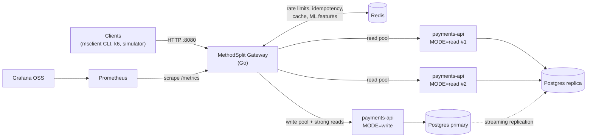
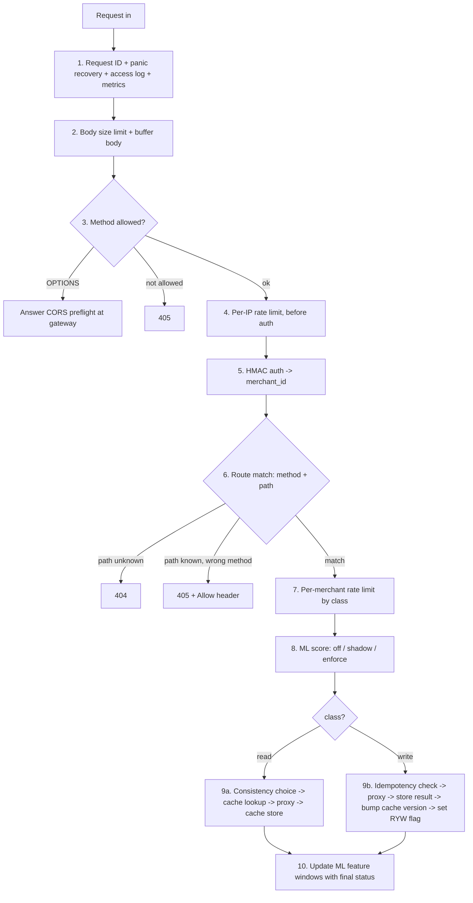
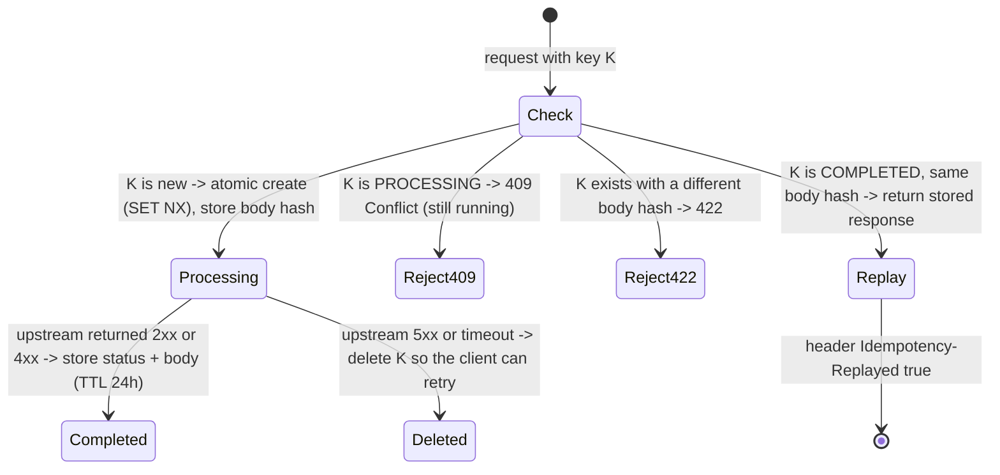

# MethodSplit — Architecture

> This is the single source of truth for **how MethodSplit is designed and why**.
> If code and this document disagree, fix one of them. Don't leave them different.
>
> Legend: ⚠️ = **critical rule**. Breaking it causes a real bug (double charge, data leak, stale data).

---

## 1. Goals, non-goals, and constraints

**Goal.** Build a Layer 7 API gateway in Go that sits in front of a payment-style API (like an MFS merchant API). It does five things:

1. Splits **read** traffic and **write** traffic into separate backend pools. A flood of status checks then cannot slow down payments.
2. Prevents **duplicate payments** when clients retry, using idempotency keys.
3. Applies **rate limits** per IP and per merchant, with different limits for reads and writes.
4. Keeps reads fast with **safe caching** and read replicas, **without serving stale payment data**.
5. Flags abusive clients with a small **ML anomaly detector** that runs inside the gateway.

**Non-goals.** It is not a general-purpose gateway like Kong or Envoy. It has no UI, no Kubernetes, no multi-region setup, and no real money.

**Constraints**
- ⚠️ **Only free and open-source tools.** No paid cloud, no paid tiers, no trial-only services. Everything runs on one laptop with Docker Compose.
- One main language (Go) for the gateway and the backend. Python is used only for offline ML training.
- Every claim in the README must come from a measurement in `docs/RESULTS.md`.

---

## 2. What was removed from the original plan (and why)

| Removed | Why |
|---|---|
| Nginx / Envoy / Express examples | The gateway is built from scratch in Go. The examples were only illustrations. |
| Rust and Node.js options | One language keeps the project focused. |
| Separate "Read LB" and "Write LB" | The gateway does its own round-robin load balancing. That's simpler, and it's code you wrote. |
| Many different microservices | One `payments-api` codebase runs in two modes (`read` and `write`). |
| Separate subdomains (`read.`, `tx.`) | One entry point, with routing by **method + path**. |
| JWT | Merchants are servers, so HMAC API-key signing is enough and more realistic for payments. |
| JSON-schema validation in the gateway | It ties the gateway to every service's schema. The backend validates bodies; the gateway only limits size and checks the JSON is well-formed. |
| Circuit-breaker library | Health checks plus timeouts are enough at this scale. |
| Kubernetes | Docker Compose is enough. |
| Render, Koyeb, Neon, Supabase, Upstash, Grafana Cloud, Docker Hub | Free-tier limits don't fit (sleeping services, request quotas, replicas behind paid plans). Everything runs locally instead. |
| ONNX, `onnx-go`, `onnxruntime-go` | `onnx-go` can't run Isolation Forest, and `onnxruntime-go` needs cgo plus a C library. A **pure-Go scorer** is used instead (section 12). |
| RL rate limiting, LSTM prefetching, DistilBERT inspection | Too much scope. One ML feature done properly beats four done badly. |
| Apache Bench, Locust | k6 only. |

**Kept (all free, run locally):** Go, PostgreSQL, Redis, Docker (Compose), Prometheus, Grafana OSS, k6, Python with scikit-learn, and GitHub with free Actions for public repos.

> Note: Redis changed its license in 2024. It is still free to use for this project. If you want a fully open-source drop-in replacement, **Valkey** works with the same client code.

---

## 3. System overview



| Container | Role | Exposed to host? |
|---|---|---|
| `gateway` | The project. The only public entry point. | Yes, `:8080` |
| `payments-read-1`, `payments-read-2` | Serve reads from the replica | ⚠️ **No** (internal network only) |
| `payments-write-1` | Serves writes and "strong" reads from the primary | ⚠️ **No** |
| `pg-primary` | Source of truth | Dev only (`:5432`) |
| `pg-replica` | Read-only copy (streaming replication) | Dev only (`:5433`) |
| `redis` | Shared fast state | Dev only |
| `prometheus`, `grafana` | Metrics and dashboards | Yes (`:9090`, `:3000`) |

⚠️ **The backend trusts the `X-Merchant-ID` header only because the gateway sets it.** So the backend must never be reachable except through the gateway, and the gateway must **delete any `X-Merchant-ID` the client sends** before setting its own.

---

## 4. Request lifecycle (the middleware chain)

Every request passes through these steps **in this exact order**:



Why this order:
- **Cheap checks come first.** The per-IP limit runs before the expensive HMAC check, so attackers can't burn CPU for free.
- **ML runs after auth** because its features are per merchant (per API key).
- **Idempotency runs just before the proxy**, so rejected requests never create idempotency records.

---

## 5. Routing

### 5.1 Route table (config-driven, not hardcoded)

The method alone does not always say whether a request reads or writes. For example, many APIs use POST for search. So **each route declares its own class**:

```yaml
split_enabled: true          # false = send everything to the write pool (baseline for experiments)
pools:
  read:  { targets: ["http://payments-read-1:9000", "http://payments-read-2:9000"] }
  write: { targets: ["http://payments-write-1:9000"] }
routes:
  - { method: POST, path: /v1/payments,              class: write, idempotency: required }
  - { method: POST, path: /v1/payments/{id}/execute, class: write, idempotency: required }
  - { method: POST, path: /v1/payments/{id}/refund,  class: write, idempotency: required }
  - { method: GET,  path: /v1/payments/{id},         class: read,  consistency: strong }
  - { method: GET,  path: /v1/payments,              class: read,  consistency: eventual, cache_ttl: 10s }
  - { method: GET,  path: /v1/balance,               class: read,  consistency: eventual }
```

- `HEAD` is treated like `GET` on the same path.
- Any method not listed for a path gets `405` with an `Allow` header.

### 5.2 Consistency levels: which pool serves a read

| Consistency | Goes to | Used for |
|---|---|---|
| `strong` | **write pool** (reads the primary) | Payment status: the client must see the real current state |
| `eventual` | read pool (replica), **unless** the read-your-writes flag is set | History, balance |

### 5.3 Read-your-writes (RYW) ⚠️

**The problem:** the replica is always slightly behind the primary (replication lag). A client that creates a payment and immediately lists its payments could get a list without the new payment.

**The fix:**
1. After any **successful write** by merchant M, set `ryw:{M}` in Redis with a 5-second TTL.
2. While that key exists, M's `eventual` reads go to the **write pool** instead of the replica.

The 5-second window must be **larger than the replication lag you actually measure** (see experiment E4). Record the measured lag in `RESULTS.md`.

### 5.4 Load balancing and health checks

- **Round-robin** across the *healthy* targets in a pool.
- **Active health checks:** `GET /healthz` every 5s with a 1s timeout. Two failures mark a target down; two successes mark it up again.
- The read-mode `/healthz` also reports **replica lag**. If the lag is above 10s, the instance reports unhealthy, so reads fall back to the write pool.
- If the **whole read pool** is down, reads fall back to the write pool, which is slower but correct.
- If the **write pool** is down, writes return `503`.

### 5.5 Timeouts and retries ⚠️

- The upstream timeout is 5s. The gateway's `http.Server` sets `ReadHeaderTimeout`, `ReadTimeout`, and `WriteTimeout`.
- **The gateway never retries a write.** A retried write can charge a customer twice. Retrying writes is the client's job, using the same idempotency key.
- A GET may be retried **once** on a different target, and only when the connection itself failed.

---

## 6. Authentication (HMAC request signing)

Each merchant has an **API key** (public) and a **secret** (private). Demo keys live in `configs/merchants.yaml`. ⚠️ **Only ever commit demo secrets.**

The client sends three headers:

| Header | Value |
|---|---|
| `X-Api-Key` | e.g. `mk_demo_a` |
| `X-Timestamp` | Unix seconds |
| `X-Signature` | `hex(HMAC_SHA256(secret, canonical_string))` |

```
canonical_string = METHOD + "\n" + PATH_WITH_QUERY + "\n" + TIMESTAMP + "\n" + hex(SHA256(BODY))
```

Rules:
- ⚠️ Compare signatures with `hmac.Equal` (constant time), never with `==`.
- Reject any request whose timestamp is more than **300 seconds** away from server time. This blocks old captured requests from being replayed.
- Never log secrets or signatures.
- On success, the gateway **removes** any client-sent `X-Merchant-ID` and sets its own.
- Count failed signatures per `X-Api-Key`. This count is one of the ML features.

Because signing by hand is painful, the repo includes `cmd/msclient`, a small CLI that signs requests for you.

---

## 7. Rate limiting

**Algorithm:** a sliding-window counter implemented as **one Redis Lua script**, so the check-and-increment is atomic.

| Limit | Key | Starting value |
|---|---|---|
| Pre-auth, per IP | `rl:ip:{ip}` | 300 / min |
| Reads, per merchant | `rl:m:{merchant}:read` | 600 / min |
| Writes, per merchant | `rl:m:{merchant}:write` | 60 / min |

These are **starting values** in config. Tune them after load testing. For k6 runs from a single IP, use a load-test config profile with a higher per-IP limit.

When a request is over the limit, the gateway returns `429` with `Retry-After`, plus `RateLimit-Limit` and `RateLimit-Remaining` headers.

---

## 8. Idempotency (duplicate-payment protection) ⚠️

**Rule:** every write route marked `idempotency: required` must carry an `Idempotency-Key` header of 1–64 characters from `[A-Za-z0-9_-]`. If it's missing, the gateway returns `400`.

**Two layers of protection:**
1. **Gateway (fast path):** a Redis record, `idem:{merchant}:{key}`.
2. **Backend (the real guarantee):** the `idempotency_records` table has `PRIMARY KEY (merchant_id, key)` and is written **in the same database transaction** as the payment change. Even if Redis is wiped, a duplicate can never create a second payment.

**Gateway flow:**



Details:
- The body hash is `SHA256(method + path + body)`. It catches a client that reuses a key for a *different* payment.
- The `PROCESSING` state has a **30s TTL**, so a crashed request never locks the key forever.
- Stored response bodies are capped at 64 KB.

---

## 9. Caching (safe version)

**What is cached:** only routes with `cache_ttl > 0` (currently the payment history list), and only `200` responses smaller than 256 KB.

**What is never cached:** payment status (`strong`) and every write.

**Cache key:**

```
cache:{merchant}:v{version}:{sha256(method + path + query)}
```

- ⚠️ **The merchant ID is always part of the key.** Without it, merchant B could receive merchant A's cached data.
- `version` comes from `cachever:{merchant}` (default 0). After any successful write, the gateway runs `INCR cachever:{merchant}`. All of that merchant's old cache entries then stop matching instantly, with no key scanning needed. Old entries simply expire by TTL.
- Response header: `X-Cache: HIT | MISS | BYPASS`.

---

## 10. Failure modes (decide now, not during an interview)

| Failure | Behavior | Why |
|---|---|---|
| Redis down, **read** request | **Fail open.** Skip cache, rate limit, and ML features; serve from backend; increment a metric. | Reads are safe to serve. |
| Redis down, **write** request | **Fail closed:** `503` | Without Redis the gateway can't enforce idempotency or rate limits. The DB still protects against duplicates, but pausing payments briefly is safer. |
| Replica down or lagging | Read pool reports unhealthy, so reads fall back to the write pool | Correct but slower |
| One read instance down | Health check removes it; round-robin continues | Covered by experiment E1 |
| Write pool down | `503` for writes; `strong` reads also fail; `eventual` reads still work | This is the fault isolation the project exists to show |
| Upstream timeout on a write | Return `504`; delete the idempotency record; **no retry** | The client retries safely with the same key |

---

## 11. Data model

```sql
CREATE TABLE merchants (
  id          TEXT PRIMARY KEY,
  name        TEXT NOT NULL,
  created_at  TIMESTAMPTZ NOT NULL DEFAULT now()
);

CREATE TABLE payments (
  id            UUID PRIMARY KEY,
  merchant_id   TEXT NOT NULL REFERENCES merchants(id),
  amount_minor  BIGINT NOT NULL CHECK (amount_minor > 0),   -- poisha, never floats for money
  currency      CHAR(3) NOT NULL DEFAULT 'BDT',
  status        TEXT NOT NULL CHECK (status IN ('CREATED','COMPLETED','REFUNDED','FAILED')),
  created_at    TIMESTAMPTZ NOT NULL DEFAULT now(),
  updated_at    TIMESTAMPTZ NOT NULL DEFAULT now()
);
CREATE INDEX ON payments (merchant_id, created_at DESC);

CREATE TABLE idempotency_records (
  merchant_id      TEXT NOT NULL,
  key              TEXT NOT NULL,
  request_hash     TEXT NOT NULL,
  response_status  INT  NOT NULL,
  response_body    JSONB NOT NULL,
  created_at       TIMESTAMPTZ NOT NULL DEFAULT now(),
  PRIMARY KEY (merchant_id, key)
);
```

- ⚠️ **Store money as integers** (`amount_minor`), never as floats.
- Status changes run in a transaction with `SELECT ... FOR UPDATE`. The allowed transitions are `CREATED → COMPLETED` and `COMPLETED → REFUNDED`; anything else returns `409`.
- Balance = sum of `COMPLETED` payments minus sum of `REFUNDED` payments.

**Replication setup** (official `postgres` image, no paid images):
- The primary uses `wal_level=replica`, has a `replicator` role, and a `pg_hba.conf` line allowing replication from the Docker network.
- The replica's entrypoint checks whether its data directory is empty. If it is, it runs `pg_basebackup -h pg-primary -U replicator -D $PGDATA -R -X stream`, then starts Postgres.
- Verify with `SELECT pg_is_in_recovery();`, which should be `true` on the replica, and check `pg_stat_replication` on the primary.

---

## 12. ML module: anomaly detection inside the gateway

### 12.1 What it detects

Abusive clients that **static rate limits miss**:
- **Slow, regular bots** that stay just under the limit.
- **ID enumeration / scraping**, where one client requests many different payment IDs.
- **Credential stuffing**, visible as many failed signatures on one key.
- **Retry storms**, where the same POST is repeated.

⚠️ **The ML module is only worth including if it beats the plain rate limiter.** The evaluation in 12.6 must show that.

### 12.2 Features (per API key, last 60 seconds)

Each feature is computed from six 10-second Redis buckets and read with a single Redis pipeline.

| Feature | Meaning | Redis structure |
|---|---|---|
| `req_count` | Requests in the window | hash `feat:{key}:{bucket}` field `req` |
| `write_ratio` | Share of requests that are writes | field `write` / `req` |
| `error_ratio` | Share of 4xx/5xx responses | field `err` / `req` |
| `auth_fail_count` | Failed signatures | field `authfail` |
| `distinct_ids` | Different payment IDs requested | HyperLogLog `feat:{key}:{bucket}:ids`, using `PFCOUNT` over six keys (union count) |
| `interarrival_cv` | Std / mean of the gaps between requests (bots are very regular, so it's low) | list of the last 20 timestamps |

Bucket keys expire after 70 seconds. Features are read **before** scoring and updated **after** the response, once the status is known.

### 12.3 Data (all free, all generated locally)

- `cmd/simulator` (Go) sends signed traffic through the gateway.
  - **Normal merchant profiles:** random (Poisson) arrivals following a create → execute → status flow, occasional errors.
  - **Attack profiles:** burst flood, low-and-slow bot, ID enumeration, credential stuffing, retry storm.
- **Each profile uses its own API keys**, so labels come from the key → profile mapping. No manual labeling is needed.
- The gateway writes one line per request to `logs/features.jsonl` containing the timestamp, request_id, api_key, route, the 6 features, and the status.
- ⚠️ **Train and test use different random seeds and different attack intensities.** Otherwise the model just memorizes your simulator.
- Be honest in the README: **the data is synthetic.**

### 12.4 Training and export (Python, offline)

- `ml/train.py` trains a scikit-learn `IsolationForest` (100 trees, `max_samples=256`) on **normal-only** training data.
- `ml/evaluate.py` picks a threshold on a validation split that keeps the **false-positive rate ≤ 1%**.
- `ml/export.py` writes `models/iforest-v1.json` containing, for each tree: `children_left`, `children_right`, `feature`, `threshold`, `n_node_samples`. It also stores `max_samples_`, `offset_`, the feature names, the model version, and the chosen threshold.

⚠️ **Export gotchas:**
1. Each tree may see the features in a **different column order**. Map every tree's feature index through `estimators_features_[t]` when exporting.
2. scikit-learn compares values as **float32**. The Go scorer must convert inputs to `float32` before comparing, or the scores won't match.

### 12.5 Serving in Go (pure Go, no cgo)

`internal/ml/iforest.go` scores a request the same way scikit-learn's `score_samples` does:

```
for each tree: walk from the root while the node is not a leaf:
    go left if x[feature] <= threshold (as float32), else right
    path = (number of nodes visited) + c(n_node_samples[leaf]) - 1
score = -2 ^ ( -mean(path) / c(max_samples) )
c(n) = 0 if n <= 1;  1 if n == 2;  otherwise 2*(ln(n-1) + 0.5772156649) - 2*(n-1)/n
```

- **Parity test:** Python writes `ml/testdata/golden.json` with 200 feature vectors and their expected scores. A Go test checks every score within `1e-6`. ⚠️ **Don't ship the model until this test passes.**
- **Latency:** measure with a Go benchmark (`go test -bench .`). Report the real number; don't assume it.
- **Model reload:** on `SIGHUP`, reload the JSON file. Expose the model version as a metric label.

### 12.6 Modes and evaluation

| Mode | What happens |
|---|---|
| `off` | Features are still logged (to collect data). |
| `shadow` | The request is scored and logged; **nothing is blocked**. Run this first. |
| `enforce` | Score above the threshold: the merchant's rate limits are cut to ¼ for 60s, and over-limit requests get `429` with `X-MethodSplit-Reason: anomaly`. |

**Evaluation (goes in `RESULTS.md`):** compare the detector against the **baseline** (only the static rate limits from section 7) on the same held-out test log.

| Metric | Baseline (static limits) | Isolation Forest |
|---|---|---|
| Recall per attack type | measure | measure |
| Precision | measure | measure |
| False-positive rate on normal merchants | measure | measure |
| Added latency, p95 | — | measure |

---

## 13. Observability

The gateway exposes Prometheus metrics at `/metrics`:

- `ms_requests_total{method, class, pool, status}`
- `ms_request_duration_seconds{class, pool}` (histogram)
- `ms_upstream_healthy{pool, target}` (gauge)
- `ms_cache_total{result="hit|miss|bypass"}`
- `ms_idempotency_total{result="new|replay|conflict|mismatch"}`
- `ms_ratelimit_rejected_total{limit="ip|read|write"}`
- `ms_redis_failopen_total`
- `ms_ml_score` (histogram), `ms_ml_flagged_total{mode}`, `ms_ml_model_info{version}`

Grafana OSS is set up automatically (a data source plus one dashboard JSON committed to the repo). Logs use Go's standard `log/slog` in JSON format, and every line includes `request_id`.

---

## 14. Security checklist

- [ ] Backend containers are not exposed to the host network.
- [ ] Client-sent `X-Merchant-ID` is removed; the gateway sets its own.
- [ ] `X-Forwarded-For` is **overwritten**, not appended to. The gateway is the edge, so it doesn't trust client values.
- [ ] Body size limit (1 MB) is enforced before reading the body.
- [ ] HMAC is compared in constant time, with the 300s timestamp window.
- [ ] No secrets or signatures appear in logs.
- [ ] Every `http.Server` and client timeout is set.
- [ ] Cache keys always include the merchant ID.
- [ ] Only demo secrets are in the repo; `.env` is in `.gitignore`.

---

## 15. Experiments (the numbers for your resume)

Every experiment records the laptop specs, versions, exact command, and raw k6 output in `docs/RESULTS.md`. Containers get CPU limits (`cpus:` in Compose) so the results are repeatable.

| ID | Question | How |
|---|---|---|
| E1 | How much latency does the gateway add? | k6 against the backend directly vs through the gateway; report p50/p95/p99 |
| E2 | **Does the split protect writes?** (the core claim) | GET flood + steady POSTs, with `split_enabled: true` vs `false`; compare POST p95 and error rate |
| E3 | Does idempotency really prevent duplicates? | 100 concurrent POSTs with the same key → count rows (**must be exactly 1**) |
| E4 | Does read-your-writes prevent stale reads? | create → list, 1,000 times, with RYW on vs off; count stale results; record replication lag |
| E5 | How much does caching help? | History reads with cache on vs off; hit ratio and p95 |
| E6 | Does the ML beat static limits? | Section 12.6 table |

---

## 16. Free deployment options

| Level | How | Cost |
|---|---|---|
| 1 (main) | `make up` on your laptop with Docker Compose | Free |
| 2 | Demo GIF or video, Grafana screenshots, `RESULTS.md` in the repo | Free |
| 3 | **GitHub Codespaces** with a `.devcontainer`: run `make up` and share port 8080 temporarily for a live demo | Free within the personal monthly allowance (check the current limit) |
| 4 (optional) | Oracle Cloud "Always Free" VM running the same Compose file | Free, but signup asks for a card for verification. Skip it if that's a problem. |

CI uses **GitHub Actions**, which is free for public repositories. Integration tests start Redis and Postgres as service containers.
